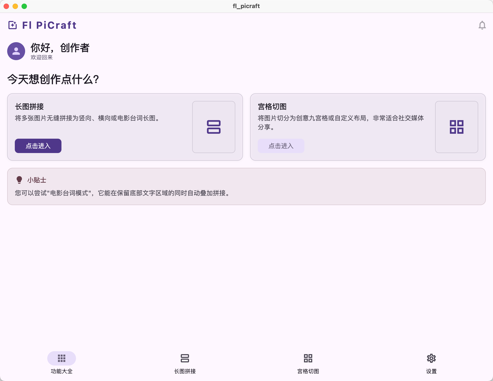
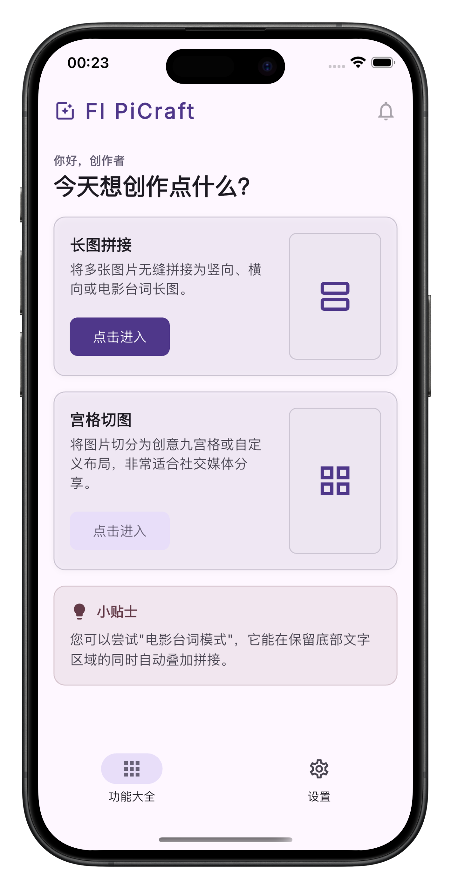
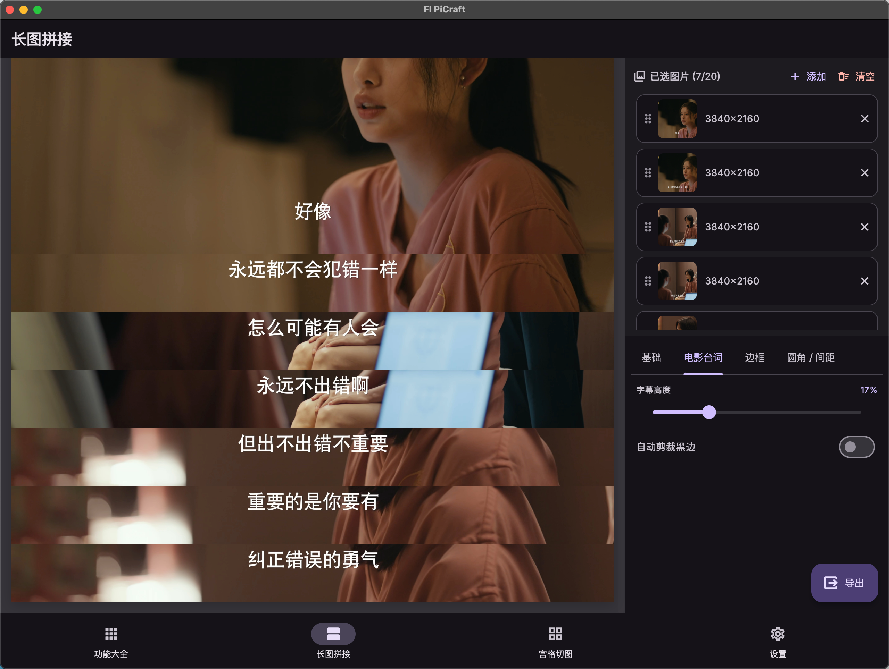
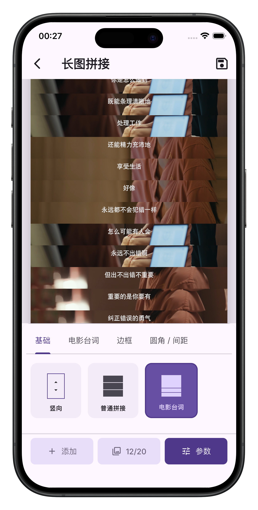
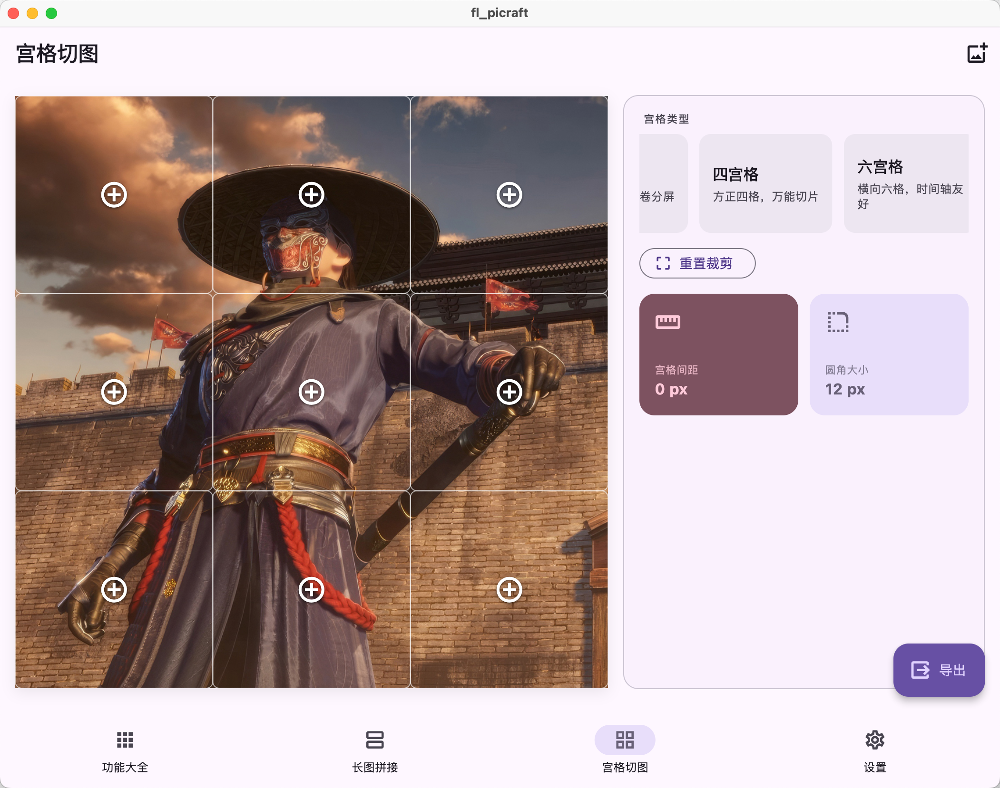
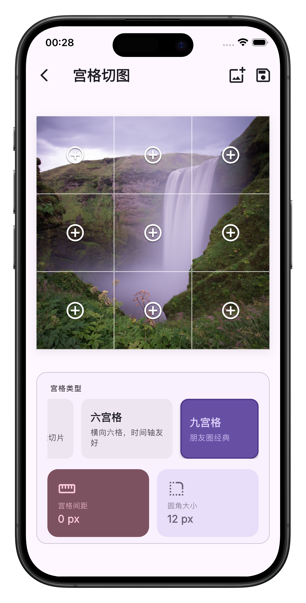
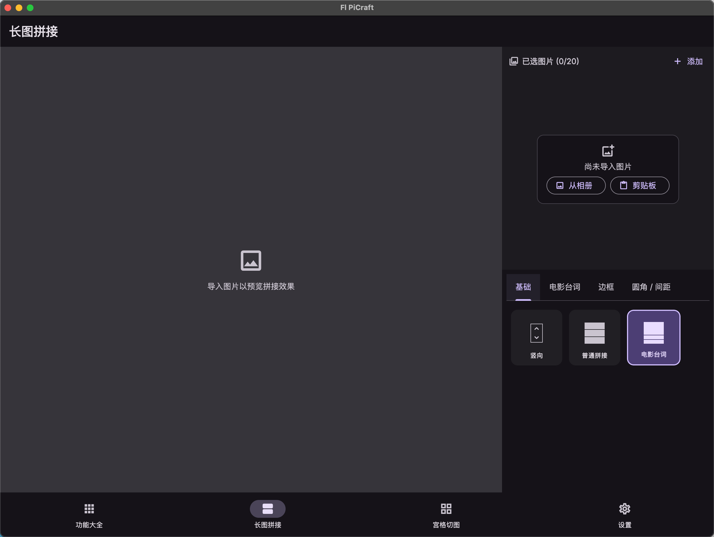
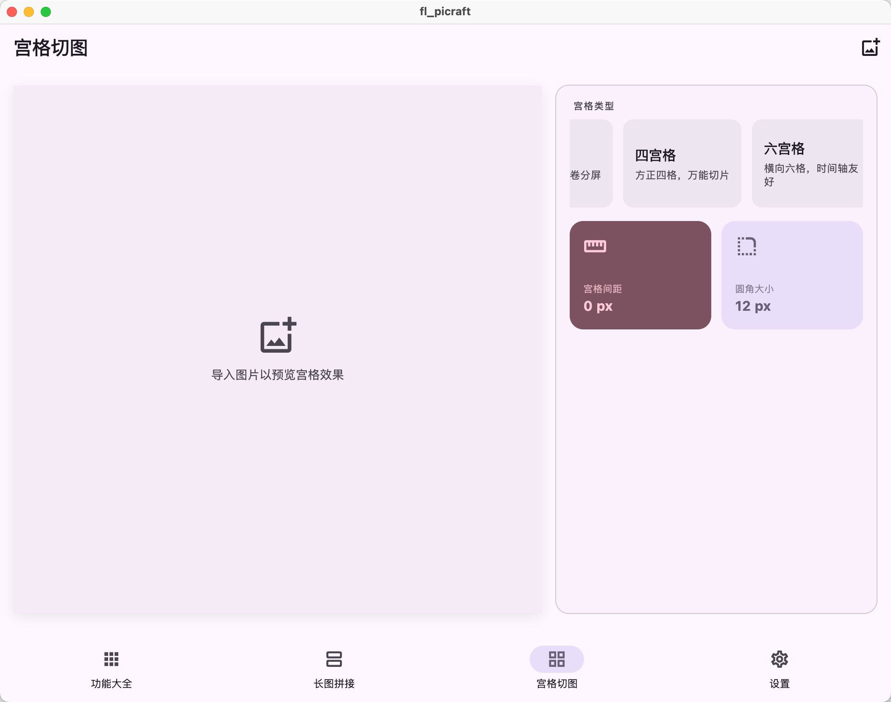

<div align="center">
  


# Fl PiCraft

一款跨平台的图像处理工具，支持竖版长图拼接与宫格切图，所有处理均在本地完成。

[](https://flutter.dev)
[](https://dart.dev)
[]()
[](./LICENSE)
</div>

## Features

- **长图拼接** — 支持纵向 / 横向多图拼接，提供边框自定义、黑边检测、拖拽排序与实时预览。
- **宫格切图** — 将单张图片切分为多种宫格布局（1×2、2×1、2×2、2×3、3×2、3×3），每个单元格支持独立的平移 /
  缩放调整。
- **水印保护** — 叠加文字水印，支持位置、字号与透明度自定义。纯 Dart 实现，运行于 isolate，不阻塞 UI 线程。
- **多源导入** — 从相册、相机、剪贴板粘贴或拖放导入图片，覆盖移动端与桌面端典型场景。
- **跨平台** — 一套代码库同时覆盖 Android、iOS、Web、macOS、Windows、Linux。自适应布局基于 Material 3
  Window Size Class，紧凑屏幕下自动切换二级页面导航。
- **本地处理** — 所有图像编解码、渲染与水印叠加均在本地完成，无需上传服务器。

## Screenshots

|              | 桌面端                                                       | 移动端                                                       |
| ------------ | ------------------------------------------------------------ | ------------------------------------------------------------ |
| **首页**     |  |  |
| **长图拼接** |  |  |
| **宫格切图** |  |  |

<details>
<summary>更多截图</summary>

|                | 桌面端                                                                             |
|----------------|---------------------------------------------------------------------------------|
| **长图拼接 - 空状态** |  |
| **宫格切图 - 空状态** |  |

</details>

## Support Devices

| Android | iOS  | macOS | Windows | Linux  |  Web   |
| :-----: | :--: | :---: | :-----: | :----: | :----: |
|    ✅    |  ✅   |   ✅   | 未测试  | 未测试 | 未测试 |

## Quick Start

### Environment Requirements

- [Flutter](https://flutter.dev) SDK `^3.10.8`
- [Dart](https://dart.dev) SDK `^3.10.0`
- 目标平台对应的开发工具链（Android Studio、Xcode、Visual Studio 等）

### Install Dependencies

```bash
flutter pub get
```

### Run the App

```bash
# 在已连接的设备 / 模拟器上运行
flutter run

# 指定平台运行
flutter run -d macos
flutter run -d windows
flutter run -d web
```

### Build Release

```bash
# Android
flutter build apk

# iOS（需在 macOS 环境下执行）
flutter build ios --no-codesign

# macOS
flutter build macos

# Windows
flutter build windows

# Linux
flutter build linux

# Web
flutter build web
```

## Project Structure

```
lib/
  main.dart
  app/                              # 应用级配置
    app.dart                        # MaterialApp.router 根组件
    router.dart                     # GoRouter 配置 (StatefulShellRoute)
    theme/                          # MD3 主题 (Inter 字体, 自定义调色板)
  core/
    constants/                      # 应用元数据、断点枚举
    errors/                         # 面向用户的错误信息
    native/                         # macOS 菜单栏桥接 (MethodChannel)
    widgets/                        # 通用组件 (导航栏, 确认对话框, 骨架屏)
  features/
    home/                           # 首页 (功能卡片 + 提示横幅)
    long_stitch/                    # 长图拼接
      data/renderers/               # 拼接图像渲染器
      domain/                       # 布局算法、黑边检测、渲染请求
      presentation/                 # 编辑器、控制面板、参数卡片
    grid/                           # 宫格切图
      data/renderers/               # 宫格图像渲染器
      domain/                       # 宫格布局算法、单元格变换
      presentation/                 # 编辑器、控制面板、宫格类型选择器
    image_import/                   # 图像导入 (相册/相机/剪贴板/拖放)
      data/datasources/             # 平台特定数据源
      domain/                       # 导入实体与仓库接口
    export/                         # 图像导出
      data/                         # 编码器、水印渲染器、平台持久化适配器
      domain/                       # 导出格式、质量、水印配置
      presentation/                 # 预览、导出页面、保存按钮
    about/                          # 关于页面
    settings/                       # 设置页面
```

架构遵循 **Clean Architecture + Feature-First** 模式，每个功能模块自包含 `data/`、`domain/`、
`presentation/` 三层，跨功能依赖通过 `domain/` 接口解耦。

## Tech Stack

| 分类   | 技术                                                                      |
|------|-------------------------------------------------------------------------|
| 框架   | [Flutter](https://flutter.dev) 3.10.8+                                  |
| 语言   | [Dart](https://dart.dev) 3.10+                                          |
| 状态管理 | [Riverpod](https://riverpod.dev) 2.6.x                                  |
| 路由   | [GoRouter](https://pub.dev/packages/go_router) 14.x                     |
| 图像处理 | [image](https://pub.dev/packages/image) 4.3.x（纯 Dart）                   |
| 主题   | Material Design 3 + [Inter](https://fonts.google.com/specimen/Inter) 字体 |
| 平台桥接 | MethodChannel（macOS 菜单）、`super_drag_and_drop`、`super_clipboard`         |
| 文件操作 | `file_picker`、`path_provider`、`gal`、`share_plus`                        |
| Web  | `package:web`、`archive`（ZIP 打包）                                         |
| 代码生成 | `build_runner` + `riverpod_generator`                                   |
| 测试   | `flutter_test` + `mocktail`                                             |

## Testing

```bash
# 运行全部测试
flutter test

# 运行单个测试文件
flutter test test/features/long_stitch/domain/stitch_layout_test.dart

# 带覆盖率
flutter test --coverage
```

项目包含 **81 个测试文件**，覆盖单元测试、Widget 测试、响应式布局、暗色模式及无障碍（a11y）验证。

## Code Style

```bash
# 格式化
dart format .

# 静态分析
flutter analyze

# 自动修复
dart fix --apply
```

本项目使用 `flutter_lints` 提供的默认规则集，未添加额外 lint 规则。

## Roadmap

- [ ] 导出页面的图片生成优化：改用 FFI 调用 Rust 处理图片

## License

本项目基于 [AGPL-3.0](LICENSE) 协议开源。

---

<div align="center">
  <sub>Built with ❤️ by <a href="https://github.com/RebornQ">RebornQ</a></sub>
</div>