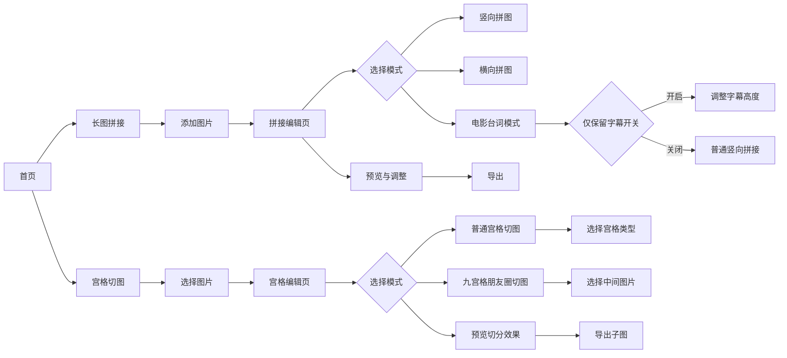
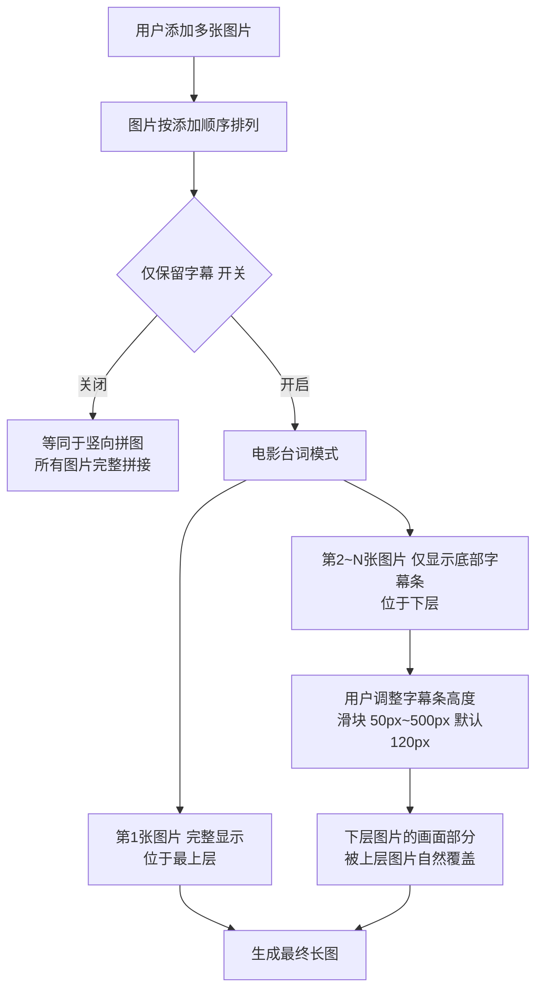

## Fl PiCraft — 产品需求文档（PRD）

### 1. 产品概述

- **产品名称**：Fl PiCraft
- **产品定位**：轻量级图片编辑工具 App，核心功能为长图拼接与宫格切图，面向全平台用户
- **目标平台**：iOS、Android、Web、桌面（macOS / Windows / Linux），基于 Flutter 实现G
- **网络要求**：全部功能离线可用，不依赖网络
- **隐私要求**：不上传任何图片到服务器，全部本地处理

---

### 2. 页面结构与导航




---

### 3. 功能模块一：长图拼接

将多张图片（最多 20 张）按顺序拼接为一张长图，提供三种拼接模式。

#### 3.1 竖向拼图

- 图片按垂直方向依次排列拼接
- 所有图片等宽对齐（以第一张图宽度为基准，或由用户指定统一宽度）
- 每张图片高度按比例缩放

#### 3.2 横向拼图

- 图片按水平方向依次排列拼接
- 所有图片等高对齐（以第一张图高度为基准，或由用户指定统一高度）
- 每张图片宽度按比例缩放

#### 3.3 电影台词模式（特色功能）

模拟 Bilibili 风格的长截图拼接效果，保留字幕连续性的同时大幅缩减图片总高度。

**核心逻辑**：




**层级规则**：

- 先添加的图片在上层，完整显示
- 后添加的图片在下层，仅露出底部固定高度的字幕条区域
- 下层图片的画面部分被上层图片自然覆盖，无需裁剪

**视觉效果**：

```
┌──────────────────┐
│                  │
│   第1张图 完整    │  ← 最上层，完整显示
│                  │
│   [字幕文字]      │
├──────────────────┤ ← 第2张图开始，画面被上层覆盖
│   [字幕文字]      │  ← 仅露出字幕条高度区域
├──────────────────┤ ← 第3张图开始，画面被上层覆盖
│   [字幕文字]      │  ← 仅露出字幕条高度区域
├──────────────────┤
│      ...         │
└──────────────────┘
```

**参数控制**：

- 「仅保留字幕」开关：关闭 = 普通竖向拼接，开启 = 电影台词模式
- 字幕条高度滑块：范围 50px ~ 500px，默认 120px，实时预览

---

### 4. 功能模块二：宫格切图

将一张图片按指定宫格切分为多张子图，支持普通宫格与九宫格朋友圈模式。

#### 4.1 普通宫格切图

**支持的宫格类型**：


| 类型  | 切分方式 | 类型  | 切分方式 |
| --- | ---- | --- | ---- |
| 1x2 | 1行2列 | 2x1 | 2行1列 |
| 1x3 | 1行3列 | 3x1 | 3行1列 |
| 1x4 | 1行4列 | 4x1 | 4行1列 |
| 2x2 | 2行2列 | 2x3 | 2行3列 |
| 3x2 | 3行2列 | 3x3 | 3行3列 |
| 4x4 | 4行4列 |     |      |


**交互流程**：

1. 选择图片后显示预览，叠加网格线显示切分效果
2. 选择宫格类型（宫格选择面板）
3. 预览每张子图
4. 一键导出所有子图

#### 4.2 九宫格朋友圈切图

专为社交媒体朋友圈设计的九宫格切图模式。

**功能描述**：

- 将一张图片切分为 3x3 共 9 张正方形子图
- 支持「朋友圈模式」：用户可选择一张不同的图片替换中间一格（第5格），用于放置头像或标识图
- 中间图片支持缩放、位置调整（适配正方形单元格）

**交互流程**：

1. 选择主图片
2. 选择是否开启「朋友圈模式」
3. 若开启，选择中间格图片并调整位置/缩放
4. 预览九宫格效果
5. 导出 9 张子图

---

### 5. 通用功能

#### 5.1 图片导入


| 导入方式  | 适用平台          | 说明          |
| ----- | ------------- | ----------- |
| 相册选择  | 全平台           | 调用系统相册，支持多选 |
| 拍照    | iOS / Android | 调用系统相机拍摄后导入 |
| 剪贴板粘贴 | 全平台           | 从剪贴板粘贴图片    |
| 拖拽文件  | 桌面 / Web      | 拖拽图片文件导入    |


#### 5.2 图片管理

- **拖拽排序**：编辑界面支持拖拽调整图片顺序
- **预览编辑**：预览时支持删除单张图片、重新排序
- **数量限制**：拼接功能最多支持 20 张图片

#### 5.3 输出调整


| 选项   | 说明                           |
| ---- | ---------------------------- |
| 图片间距 | 拼接图片之间的间距，范围 0 ~ 50px，默认 0px |
| 边框   | 为拼接图添加边框，可设置宽度与颜色            |
| 圆角   | 为整体输出图或单张图设置圆角效果             |


#### 5.4 导出

- 保存到本地相册（移动端）或文件系统（桌面 / Web）
- 格式选择：PNG / JPG
- 质量设置：JPG 质量 1% ~ 100%

#### 5.5 水印功能（可选）

- 导出时可选择是否添加水印
- 支持文字水印，可自定义水印文字内容
- 支持设置水印位置（四角 + 居中）
- 支持设置水印透明度（10% ~ 100%）
- 支持设置水印大小

---

### 6. 建议技术栈


| 类别   | 选型                                    |
| ---- | ------------------------------------- |
| 框架   | Flutter                               |
| 图片处理 | `image` 库（Dart 原生）                    |
| 图片选择 | `image_picker`                        |
| 拖拽排序 | `reorderables` 或自定义 `GestureDetector` |
| 文件保存 | `image_gallery_saver`（移动端）+ 各平台原生保存   |
| 状态管理 | `riverpod`                            |
| 路由管理 | `go_router`                           |


---

### 7. 非功能性需求


| 项目  | 要求                                               |
| --- | ------------------------------------------------ |
| 性能  | 20 张图片拼接导出不超过 5 秒                                |
| 内存  | 处理大图时不超过 500MB                                   |
| 兼容性 | iOS 12+、Android 6+、主流浏览器、macOS / Windows / Linux |
| 离线  | 全部功能离线可用                                         |
| 隐私  | 不上传任何图片到服务器                                      |


---

### 8. 实施步骤

1. **项目初始化**：创建 Flutter 项目，配置多平台支持，引入核心依赖
2. **基础架构搭建**：配置 Riverpod 状态管理、GoRouter 路由、主题系统
3. **图片导入模块**：实现相册、拍照、剪贴板、拖拽四种导入方式
4. **竖向 / 横向拼图**：实现基础拼接逻辑、图片等宽/等高缩放、间距/边框/圆角
5. **电影台词模式**：实现层级覆盖拼接、字幕高度调整滑块、实时预览
6. **普通宫格切图**：实现全部宫格类型、网格线预览、子图导出
7. **九宫格朋友圈模式**：实现 3x3 切分、中间格图片替换、缩放调整
8. **水印功能**：实现文字水印、位置/透明度/大小设置
9. **导出模块**：实现格式选择、质量设置、多平台保存
10. **UI 优化与测试**：打磨交互体验、全平台适配测试

